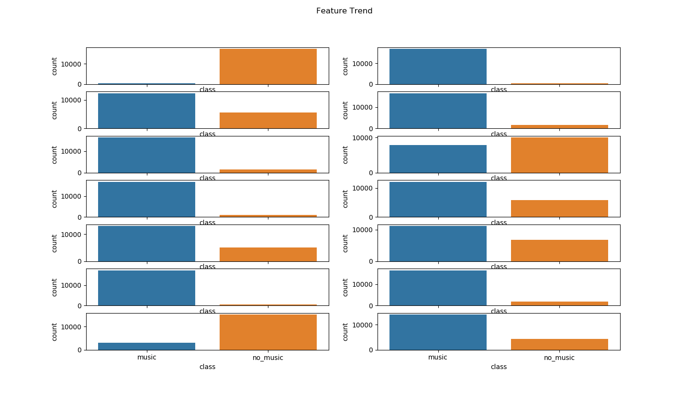

# Notes

In this document, I store all remarks I make during running different code. This information might not always be of interest to the project, but because I'd prefer to keep all those remarks without the need to document extra stuff.

## Trends in Features

* All features are normalized, except for the last two ones (f704, f705), but I still don't know what these values are (see figure below).

  

* I don't see any trends in the densities of first 9 features. 

  

* Distributions don't allow us to make any interpretations on the data, therefore, we need to first extract features that are more informative using the Principle Component, and then we can plot those features using the time series.

  

* There's a huge class imbalance in all files, sometimes the positive class is dominant, other time the negative one is the dominant.

  

* The same goes for music files. Here these two plots make absolute sense, because as you can observe in the first hour where there was a lot of Speech there wasn't music, and the same goes for the rest of these 14 hours except the 2nd hour, what could this hour have? These two plots follow the same order.

  

* This one is also interesting, because you can see that when there's Speech most features are very flat. Here, one another remark can made about the music data: the music values are always more extremer [-0.3 :0.7] than those of Speech [0.0: 0.175].

  